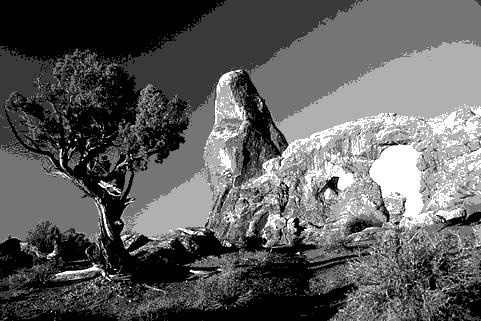
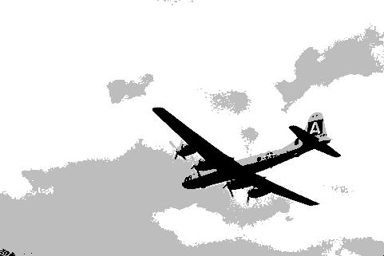

Pratical Work - Segmentation
============================

|Original Image|K-means++ - 3 clusters|Otsu's - 3 thresholds|K-means++ - 5 clusters|Otsu's - 5 thresholds|
| :---: | :---: | :---: | :---: | :---: |
||Time taken to segment: 0.922 seconds  **MeanStructuralSimilitaryIndex**: 0.55 **MeanSquaredError**: 3305.74|Time taken to segment: 0.021 seconds  **MeanStructuralSimilitaryIndex**: 0.52 **MeanSquaredError**: 2858.32|Time taken to segment: 1.674 seconds  **MeanStructuralSimilitaryIndex**: 0.75 **MeanSquaredError**: 1023.28|Time taken to segment: 5.316 seconds  **MeanStructuralSimilitaryIndex**: 0.68 **MeanSquaredError**: 825.42|
||Time taken to segment: 1.431 seconds  **MeanStructuralSimilitaryIndex**: 0.35 **MeanSquaredError**: 2535.11|Time taken to segment: 0.017 seconds  **MeanStructuralSimilitaryIndex**: 0.29 **MeanSquaredError**: 2868.60|Time taken to segment: 1.859 seconds  **MeanStructuralSimilitaryIndex**: 0.57 **MeanSquaredError**: 1220.36|Time taken to segment: 5.540 seconds  **MeanStructuralSimilitaryIndex**: 0.51 **MeanSquaredError**: 1338.60|
||Time taken to segment: 0.929 seconds  **MeanStructuralSimilitaryIndex**: 0.55 **MeanSquaredError**: 2331.10|Time taken to segment: 0.013 seconds  **MeanStructuralSimilitaryIndex**: 0.44 **MeanSquaredError**: 3165.09|Time taken to segment: 1.743 seconds  **MeanStructuralSimilitaryIndex**: 0.71 **MeanSquaredError**: 570.83|Time taken to segment: 5.346 seconds  **MeanStructuralSimilitaryIndex**: 0.59 **MeanSquaredError**: 841.58|
||Time taken to segment: 0.736 seconds  **MeanStructuralSimilitaryIndex**: 0.48 **MeanSquaredError**: 2276.60|Time taken to segment: 0.015 seconds  **MeanStructuralSimilitaryIndex**: 0.44 **MeanSquaredError**: 1807.47|Time taken to segment: 1.385 seconds  **MeanStructuralSimilitaryIndex**: 0.68 **MeanSquaredError**: 981.17|Time taken to segment: 5.719 seconds  **MeanStructuralSimilitaryIndex**: 0.66 **MeanSquaredError**: 1043.00|
||Time taken to segment: 0.929 seconds  **MeanStructuralSimilitaryIndex**: 0.44 **MeanSquaredError**: 1219.45|Time taken to segment: 0.012 seconds  **MeanStructuralSimilitaryIndex**: 0.36 **MeanSquaredError**: 1281.32|Time taken to segment: 1.662 seconds  **MeanStructuralSimilitaryIndex**: 0.60 **MeanSquaredError**: 585.71|Time taken to segment: 5.870 seconds  **MeanStructuralSimilitaryIndex**: 0.46 **MeanSquaredError**: 974.46|
||Time taken to segment: 0.933 seconds  **MeanStructuralSimilitaryIndex**: 0.71 **MeanSquaredError**: 1080.76|Time taken to segment: 0.015 seconds  **MeanStructuralSimilitaryIndex**: 0.61 **MeanSquaredError**: 1396.36|Time taken to segment: 1.363 seconds  **MeanStructuralSimilitaryIndex**: 0.80 **MeanSquaredError**: 425.53|Time taken to segment: 5.581 seconds  **MeanStructuralSimilitaryIndex**: 0.69 **MeanSquaredError**: 1047.20|
||Time taken to segment: 0.832 seconds  **MeanStructuralSimilitaryIndex**: 0.46 **MeanSquaredError**: 6999.98|Time taken to segment: 0.016 seconds  **MeanStructuralSimilitaryIndex**: 0.47 **MeanSquaredError**: 6683.47|Time taken to segment: 1.487 seconds  **MeanStructuralSimilitaryIndex**: 0.54 **MeanSquaredError**: 2840.55|Time taken to segment: 5.251 seconds  **MeanStructuralSimilitaryIndex**: 0.53 **MeanSquaredError**: 2640.70|
||Time taken to segment: 1.227 seconds  **MeanStructuralSimilitaryIndex**: 0.44 **MeanSquaredError**: 3144.14|Time taken to segment: 0.013 seconds  **MeanStructuralSimilitaryIndex**: 0.37 **MeanSquaredError**: 3223.83|Time taken to segment: 1.672 seconds  **MeanStructuralSimilitaryIndex**: 0.70 **MeanSquaredError**: 825.26|Time taken to segment: 5.485 seconds  **MeanStructuralSimilitaryIndex**: 0.49 **MeanSquaredError**: 1939.96|
||Time taken to segment: 0.979 seconds  **MeanStructuralSimilitaryIndex**: 0.45 **MeanSquaredError**: 3487.42|Time taken to segment: 0.015 seconds  **MeanStructuralSimilitaryIndex**: 0.41 **MeanSquaredError**: 2547.01|Time taken to segment: 1.662 seconds  **MeanStructuralSimilitaryIndex**: 0.58 **MeanSquaredError**: 2725.93|Time taken to segment: 5.345 seconds  **MeanStructuralSimilitaryIndex**: 0.50 **MeanSquaredError**: 1737.49|
||Time taken to segment: 0.959 seconds  **MeanStructuralSimilitaryIndex**: 0.33 **MeanSquaredError**: 2817.09|Time taken to segment: 0.015 seconds  **MeanStructuralSimilitaryIndex**: 0.26 **MeanSquaredError**: 2992.76|Time taken to segment: 1.641 seconds  **MeanStructuralSimilitaryIndex**: 0.51 **MeanSquaredError**: 1778.70|Time taken to segment: 5.222 seconds  **MeanStructuralSimilitaryIndex**: 0.45 **MeanSquaredError**: 1522.85|
||Time taken to segment: 1.039 seconds  **MeanStructuralSimilitaryIndex**: 0.45 **MeanSquaredError**: 4493.23|Time taken to segment: 0.013 seconds  **MeanStructuralSimilitaryIndex**: 0.39 **MeanSquaredError**: 5079.67|Time taken to segment: 1.731 seconds  **MeanStructuralSimilitaryIndex**: 0.62 **MeanSquaredError**: 1766.07|Time taken to segment: 5.112 seconds  **MeanStructuralSimilitaryIndex**: 0.55 **MeanSquaredError**: 2603.39|
||Time taken to segment: 1.040 seconds  **MeanStructuralSimilitaryIndex**: 0.44 **MeanSquaredError**: 4771.69|Time taken to segment: 0.013 seconds  **MeanStructuralSimilitaryIndex**: 0.39 **MeanSquaredError**: 5186.05|Time taken to segment: 1.368 seconds  **MeanStructuralSimilitaryIndex**: 0.56 **MeanSquaredError**: 2265.43|Time taken to segment: 5.120 seconds  **MeanStructuralSimilitaryIndex**: 0.53 **MeanSquaredError**: 2469.31|
||Time taken to segment: 1.156 seconds  **MeanStructuralSimilitaryIndex**: 0.48 **MeanSquaredError**: 2342.72|Time taken to segment: 0.013 seconds  **MeanStructuralSimilitaryIndex**: 0.37 **MeanSquaredError**: 3312.33|Time taken to segment: 1.953 seconds  **MeanStructuralSimilitaryIndex**: 0.73 **MeanSquaredError**: 610.68|Time taken to segment: 5.684 seconds  **MeanStructuralSimilitaryIndex**: 0.59 **MeanSquaredError**: 1583.56|
||Time taken to segment: 0.827 seconds  **MeanStructuralSimilitaryIndex**: 0.67 **MeanSquaredError**: 12530.15|Time taken to segment: 0.015 seconds  **MeanStructuralSimilitaryIndex**: 0.70 **MeanSquaredError**: 10661.68|Time taken to segment: 1.160 seconds  **MeanStructuralSimilitaryIndex**: 0.64 **MeanSquaredError**: 9124.41|Time taken to segment: 5.370 seconds  **MeanStructuralSimilitaryIndex**: 0.67 **MeanSquaredError**: 6018.87|
||Time taken to segment: 0.885 seconds  **MeanStructuralSimilitaryIndex**: 0.52 **MeanSquaredError**: 1896.01|Time taken to segment: 0.015 seconds  **MeanStructuralSimilitaryIndex**: 0.42 **MeanSquaredError**: 2081.28|Time taken to segment: 1.507 seconds  **MeanStructuralSimilitaryIndex**: 0.72 **MeanSquaredError**: 735.21|Time taken to segment: 5.311 seconds  **MeanStructuralSimilitaryIndex**: 0.59 **MeanSquaredError**: 916.66|
||Time taken to segment: 0.847 seconds  **MeanStructuralSimilitaryIndex**: 0.80 **MeanSquaredError**: 2971.71|Time taken to segment: 0.012 seconds  **MeanStructuralSimilitaryIndex**: 0.79 **MeanSquaredError**: 3072.93|Time taken to segment: 1.857 seconds  **MeanStructuralSimilitaryIndex**: 0.83 **MeanSquaredError**: 2442.13|Time taken to segment: 5.416 seconds  **MeanStructuralSimilitaryIndex**: 0.81 **MeanSquaredError**: 2340.02|
||Time taken to segment: 0.913 seconds  **MeanStructuralSimilitaryIndex**: 0.41 **MeanSquaredError**: 1763.83|Time taken to segment: 0.015 seconds  **MeanStructuralSimilitaryIndex**: 0.31 **MeanSquaredError**: 1920.15|Time taken to segment: 1.585 seconds  **MeanStructuralSimilitaryIndex**: 0.51 **MeanSquaredError**: 1353.38|Time taken to segment: 5.451 seconds  **MeanStructuralSimilitaryIndex**: 0.41 **MeanSquaredError**: 1477.38|
||Time taken to segment: 1.048 seconds  **MeanStructuralSimilitaryIndex**: 0.33 **MeanSquaredError**: 5324.33|Time taken to segment: 0.014 seconds  **MeanStructuralSimilitaryIndex**: 0.30 **MeanSquaredError**: 5896.92|Time taken to segment: 1.479 seconds  **MeanStructuralSimilitaryIndex**: 0.52 **MeanSquaredError**: 1907.40|Time taken to segment: 5.215 seconds  **MeanStructuralSimilitaryIndex**: 0.45 **MeanSquaredError**: 3502.91|
||Time taken to segment: 0.967 seconds  **MeanStructuralSimilitaryIndex**: 0.50 **MeanSquaredError**: 3329.08|Time taken to segment: 0.015 seconds  **MeanStructuralSimilitaryIndex**: 0.30 **MeanSquaredError**: 4103.14|Time taken to segment: 1.716 seconds  **MeanStructuralSimilitaryIndex**: 0.70 **MeanSquaredError**: 1413.20|Time taken to segment: 5.448 seconds  **MeanStructuralSimilitaryIndex**: 0.47 **MeanSquaredError**: 2412.27|
||Time taken to segment: 0.899 seconds  **MeanStructuralSimilitaryIndex**: 0.41 **MeanSquaredError**: 3148.93|Time taken to segment: 0.014 seconds  **MeanStructuralSimilitaryIndex**: 0.36 **MeanSquaredError**: 3275.68|Time taken to segment: 2.297 seconds  **MeanStructuralSimilitaryIndex**: 0.53 **MeanSquaredError**: 1811.92|Time taken to segment: 5.469 seconds  **MeanStructuralSimilitaryIndex**: 0.47 **MeanSquaredError**: 1883.25|
