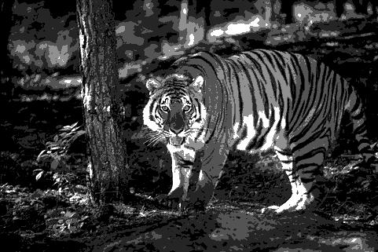
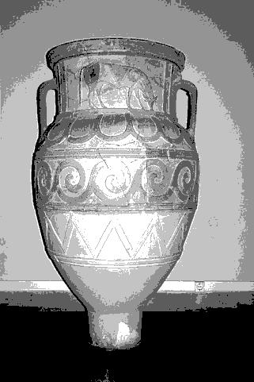
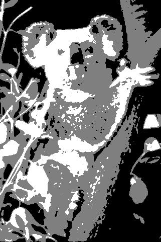

Pratical Work - Segmentation
============================

|Original Image|K-means++ - 3 clusters|Otsu's - 3 thresholds|K-means++ - 5 clusters|Otsu's - 5 thresholds|
| :---: | :---: | :---: | :---: | :---: |
||Time taken to segment: 1.788 seconds  **MeanStructuralSimilitaryIndex**: 0.55 **MeanSquaredError**: 3304.50 **PeakSignalNoiseRatio**: 12.94|Time taken to segment: 0.034 seconds  **MeanStructuralSimilitaryIndex**: 0.52 **MeanSquaredError**: 2858.32 **PeakSignalNoiseRatio**: 13.57|Time taken to segment: 1.862 seconds  **MeanStructuralSimilitaryIndex**: 0.76 **MeanSquaredError**: 996.10 **PeakSignalNoiseRatio**: 18.15|Time taken to segment: 7.557 seconds  **MeanStructuralSimilitaryIndex**: 0.68 **MeanSquaredError**: 825.42 **PeakSignalNoiseRatio**: 18.96|
||Time taken to segment: 2.300 seconds  **MeanStructuralSimilitaryIndex**: 0.35 **MeanSquaredError**: 2535.11 **PeakSignalNoiseRatio**: 14.09|Time taken to segment: 0.035 seconds  **MeanStructuralSimilitaryIndex**: 0.29 **MeanSquaredError**: 2868.60 **PeakSignalNoiseRatio**: 13.55|Time taken to segment: 2.643 seconds  **MeanStructuralSimilitaryIndex**: 0.57 **MeanSquaredError**: 1214.83 **PeakSignalNoiseRatio**: 17.29|Time taken to segment: 6.977 seconds  **MeanStructuralSimilitaryIndex**: 0.51 **MeanSquaredError**: 1338.60 **PeakSignalNoiseRatio**: 16.86|
||Time taken to segment: 1.313 seconds  **MeanStructuralSimilitaryIndex**: 0.55 **MeanSquaredError**: 2331.10 **PeakSignalNoiseRatio**: 14.46|Time taken to segment: 0.022 seconds  **MeanStructuralSimilitaryIndex**: 0.44 **MeanSquaredError**: 3165.09 **PeakSignalNoiseRatio**: 13.13|Time taken to segment: 2.819 seconds  **MeanStructuralSimilitaryIndex**: 0.71 **MeanSquaredError**: 591.33 **PeakSignalNoiseRatio**: 20.41|Time taken to segment: 7.179 seconds  **MeanStructuralSimilitaryIndex**: 0.59 **MeanSquaredError**: 841.58 **PeakSignalNoiseRatio**: 18.88|
||Time taken to segment: 0.834 seconds  **MeanStructuralSimilitaryIndex**: 0.48 **MeanSquaredError**: 2276.60 **PeakSignalNoiseRatio**: 14.56|Time taken to segment: 0.015 seconds  **MeanStructuralSimilitaryIndex**: 0.44 **MeanSquaredError**: 1807.47 **PeakSignalNoiseRatio**: 15.56|Time taken to segment: 1.857 seconds  **MeanStructuralSimilitaryIndex**: 0.68 **MeanSquaredError**: 957.73 **PeakSignalNoiseRatio**: 18.32|Time taken to segment: 7.307 seconds  **MeanStructuralSimilitaryIndex**: 0.66 **MeanSquaredError**: 1043.00 **PeakSignalNoiseRatio**: 17.95|
||Time taken to segment: 1.043 seconds  **MeanStructuralSimilitaryIndex**: 0.44 **MeanSquaredError**: 1234.84 **PeakSignalNoiseRatio**: 17.21|Time taken to segment: 0.020 seconds  **MeanStructuralSimilitaryIndex**: 0.36 **MeanSquaredError**: 1281.32 **PeakSignalNoiseRatio**: 17.05|Time taken to segment: 2.223 seconds  **MeanStructuralSimilitaryIndex**: 0.60 **MeanSquaredError**: 592.13 **PeakSignalNoiseRatio**: 20.41|Time taken to segment: 6.823 seconds  **MeanStructuralSimilitaryIndex**: 0.46 **MeanSquaredError**: 974.46 **PeakSignalNoiseRatio**: 18.24|
||Time taken to segment: 1.051 seconds  **MeanStructuralSimilitaryIndex**: 0.71 **MeanSquaredError**: 1080.76 **PeakSignalNoiseRatio**: 17.79|Time taken to segment: 0.021 seconds  **MeanStructuralSimilitaryIndex**: 0.61 **MeanSquaredError**: 1396.36 **PeakSignalNoiseRatio**: 16.68|Time taken to segment: 1.991 seconds  **MeanStructuralSimilitaryIndex**: 0.80 **MeanSquaredError**: 425.18 **PeakSignalNoiseRatio**: 21.85|Time taken to segment: 7.055 seconds  **MeanStructuralSimilitaryIndex**: 0.69 **MeanSquaredError**: 1047.20 **PeakSignalNoiseRatio**: 17.93|
||Time taken to segment: 1.135 seconds  **MeanStructuralSimilitaryIndex**: 0.46 **MeanSquaredError**: 7091.14 **PeakSignalNoiseRatio**: 9.62|Time taken to segment: 0.034 seconds  **MeanStructuralSimilitaryIndex**: 0.47 **MeanSquaredError**: 6683.47 **PeakSignalNoiseRatio**: 9.88|Time taken to segment: 1.772 seconds  **MeanStructuralSimilitaryIndex**: 0.54 **MeanSquaredError**: 2843.20 **PeakSignalNoiseRatio**: 13.59|Time taken to segment: 6.346 seconds  **MeanStructuralSimilitaryIndex**: 0.53 **MeanSquaredError**: 2640.70 **PeakSignalNoiseRatio**: 13.91|
||Time taken to segment: 1.234 seconds  **MeanStructuralSimilitaryIndex**: 0.44 **MeanSquaredError**: 3144.14 **PeakSignalNoiseRatio**: 13.16|Time taken to segment: 0.014 seconds  **MeanStructuralSimilitaryIndex**: 0.37 **MeanSquaredError**: 3223.83 **PeakSignalNoiseRatio**: 13.05|Time taken to segment: 2.360 seconds  **MeanStructuralSimilitaryIndex**: 0.70 **MeanSquaredError**: 781.57 **PeakSignalNoiseRatio**: 19.20|Time taken to segment: 6.881 seconds  **MeanStructuralSimilitaryIndex**: 0.49 **MeanSquaredError**: 1939.96 **PeakSignalNoiseRatio**: 15.25|
||Time taken to segment: 1.105 seconds  **MeanStructuralSimilitaryIndex**: 0.45 **MeanSquaredError**: 3491.93 **PeakSignalNoiseRatio**: 12.70|Time taken to segment: 0.024 seconds  **MeanStructuralSimilitaryIndex**: 0.41 **MeanSquaredError**: 2547.01 **PeakSignalNoiseRatio**: 14.07|Time taken to segment: 2.242 seconds  **MeanStructuralSimilitaryIndex**: 0.59 **MeanSquaredError**: 2630.04 **PeakSignalNoiseRatio**: 13.93|Time taken to segment: 6.584 seconds  **MeanStructuralSimilitaryIndex**: 0.50 **MeanSquaredError**: 1737.49 **PeakSignalNoiseRatio**: 15.73|
||Time taken to segment: 1.754 seconds  **MeanStructuralSimilitaryIndex**: 0.33 **MeanSquaredError**: 2817.09 **PeakSignalNoiseRatio**: 13.63|Time taken to segment: 0.016 seconds  **MeanStructuralSimilitaryIndex**: 0.26 **MeanSquaredError**: 2992.76 **PeakSignalNoiseRatio**: 13.37|Time taken to segment: 2.101 seconds  **MeanStructuralSimilitaryIndex**: 0.50 **MeanSquaredError**: 1810.40 **PeakSignalNoiseRatio**: 15.55|Time taken to segment: 6.945 seconds  **MeanStructuralSimilitaryIndex**: 0.45 **MeanSquaredError**: 1522.85 **PeakSignalNoiseRatio**: 16.30|
||Time taken to segment: 1.130 seconds  **MeanStructuralSimilitaryIndex**: 0.45 **MeanSquaredError**: 4725.44 **PeakSignalNoiseRatio**: 11.39|Time taken to segment: 0.014 seconds  **MeanStructuralSimilitaryIndex**: 0.39 **MeanSquaredError**: 5079.67 **PeakSignalNoiseRatio**: 11.07|Time taken to segment: 1.667 seconds  **MeanStructuralSimilitaryIndex**: 0.62 **MeanSquaredError**: 1647.55 **PeakSignalNoiseRatio**: 15.96|Time taken to segment: 6.135 seconds  **MeanStructuralSimilitaryIndex**: 0.55 **MeanSquaredError**: 2603.39 **PeakSignalNoiseRatio**: 13.98|
||Time taken to segment: 1.198 seconds  **MeanStructuralSimilitaryIndex**: 0.44 **MeanSquaredError**: 4771.69 **PeakSignalNoiseRatio**: 11.34|Time taken to segment: 0.015 seconds  **MeanStructuralSimilitaryIndex**: 0.39 **MeanSquaredError**: 5186.05 **PeakSignalNoiseRatio**: 10.98|Time taken to segment: 1.774 seconds  **MeanStructuralSimilitaryIndex**: 0.57 **MeanSquaredError**: 2277.03 **PeakSignalNoiseRatio**: 14.56|Time taken to segment: 6.905 seconds  **MeanStructuralSimilitaryIndex**: 0.53 **MeanSquaredError**: 2469.31 **PeakSignalNoiseRatio**: 14.21|
||Time taken to segment: 1.339 seconds  **MeanStructuralSimilitaryIndex**: 0.47 **MeanSquaredError**: 2345.23 **PeakSignalNoiseRatio**: 14.43|Time taken to segment: 0.017 seconds  **MeanStructuralSimilitaryIndex**: 0.37 **MeanSquaredError**: 3312.33 **PeakSignalNoiseRatio**: 12.93|Time taken to segment: 1.992 seconds  **MeanStructuralSimilitaryIndex**: 0.73 **MeanSquaredError**: 636.02 **PeakSignalNoiseRatio**: 20.10|Time taken to segment: 6.093 seconds  **MeanStructuralSimilitaryIndex**: 0.59 **MeanSquaredError**: 1583.56 **PeakSignalNoiseRatio**: 16.13|
||Time taken to segment: 0.981 seconds  **MeanStructuralSimilitaryIndex**: 0.67 **MeanSquaredError**: 12285.15 **PeakSignalNoiseRatio**: 7.24|Time taken to segment: 0.016 seconds  **MeanStructuralSimilitaryIndex**: 0.70 **MeanSquaredError**: 10661.68 **PeakSignalNoiseRatio**: 7.85|Time taken to segment: 1.533 seconds  **MeanStructuralSimilitaryIndex**: 0.65 **MeanSquaredError**: 9061.15 **PeakSignalNoiseRatio**: 8.56|Time taken to segment: 6.885 seconds  **MeanStructuralSimilitaryIndex**: 0.67 **MeanSquaredError**: 6018.87 **PeakSignalNoiseRatio**: 10.34|
||Time taken to segment: 1.059 seconds  **MeanStructuralSimilitaryIndex**: 0.52 **MeanSquaredError**: 1896.01 **PeakSignalNoiseRatio**: 15.35|Time taken to segment: 0.027 seconds  **MeanStructuralSimilitaryIndex**: 0.42 **MeanSquaredError**: 2081.28 **PeakSignalNoiseRatio**: 14.95|Time taken to segment: 2.056 seconds  **MeanStructuralSimilitaryIndex**: 0.72 **MeanSquaredError**: 728.64 **PeakSignalNoiseRatio**: 19.51|Time taken to segment: 6.158 seconds  **MeanStructuralSimilitaryIndex**: 0.59 **MeanSquaredError**: 916.66 **PeakSignalNoiseRatio**: 18.51|
||Time taken to segment: 1.138 seconds  **MeanStructuralSimilitaryIndex**: 0.81 **MeanSquaredError**: 3068.37 **PeakSignalNoiseRatio**: 13.26|Time taken to segment: 0.020 seconds  **MeanStructuralSimilitaryIndex**: 0.79 **MeanSquaredError**: 3072.93 **PeakSignalNoiseRatio**: 13.26|Time taken to segment: 1.859 seconds  **MeanStructuralSimilitaryIndex**: 0.83 **MeanSquaredError**: 2451.68 **PeakSignalNoiseRatio**: 14.24|Time taken to segment: 6.638 seconds  **MeanStructuralSimilitaryIndex**: 0.81 **MeanSquaredError**: 2340.02 **PeakSignalNoiseRatio**: 14.44|
||Time taken to segment: 0.916 seconds  **MeanStructuralSimilitaryIndex**: 0.41 **MeanSquaredError**: 1765.92 **PeakSignalNoiseRatio**: 15.66|Time taken to segment: 0.014 seconds  **MeanStructuralSimilitaryIndex**: 0.31 **MeanSquaredError**: 1920.15 **PeakSignalNoiseRatio**: 15.30|Time taken to segment: 1.862 seconds  **MeanStructuralSimilitaryIndex**: 0.51 **MeanSquaredError**: 1353.25 **PeakSignalNoiseRatio**: 16.82|Time taken to segment: 6.526 seconds  **MeanStructuralSimilitaryIndex**: 0.41 **MeanSquaredError**: 1477.38 **PeakSignalNoiseRatio**: 16.44|
||Time taken to segment: 1.098 seconds  **MeanStructuralSimilitaryIndex**: 0.33 **MeanSquaredError**: 5468.04 **PeakSignalNoiseRatio**: 10.75|Time taken to segment: 0.014 seconds  **MeanStructuralSimilitaryIndex**: 0.30 **MeanSquaredError**: 5896.92 **PeakSignalNoiseRatio**: 10.42|Time taken to segment: 1.825 seconds  **MeanStructuralSimilitaryIndex**: 0.51 **MeanSquaredError**: 2212.14 **PeakSignalNoiseRatio**: 14.68|Time taken to segment: 6.818 seconds  **MeanStructuralSimilitaryIndex**: 0.45 **MeanSquaredError**: 3502.91 **PeakSignalNoiseRatio**: 12.69|
||Time taken to segment: 1.195 seconds  **MeanStructuralSimilitaryIndex**: 0.50 **MeanSquaredError**: 3349.96 **PeakSignalNoiseRatio**: 12.88|Time taken to segment: 0.014 seconds  **MeanStructuralSimilitaryIndex**: 0.30 **MeanSquaredError**: 4103.14 **PeakSignalNoiseRatio**: 12.00|Time taken to segment: 1.891 seconds  **MeanStructuralSimilitaryIndex**: 0.70 **MeanSquaredError**: 1413.20 **PeakSignalNoiseRatio**: 16.63|Time taken to segment: 6.362 seconds  **MeanStructuralSimilitaryIndex**: 0.47 **MeanSquaredError**: 2412.27 **PeakSignalNoiseRatio**: 14.31|
||Time taken to segment: 1.090 seconds  **MeanStructuralSimilitaryIndex**: 0.41 **MeanSquaredError**: 3108.59 **PeakSignalNoiseRatio**: 13.21|Time taken to segment: 0.018 seconds  **MeanStructuralSimilitaryIndex**: 0.36 **MeanSquaredError**: 3275.68 **PeakSignalNoiseRatio**: 12.98|Time taken to segment: 3.247 seconds  **MeanStructuralSimilitaryIndex**: 0.53 **MeanSquaredError**: 1826.08 **PeakSignalNoiseRatio**: 15.52|Time taken to segment: 7.135 seconds  **MeanStructuralSimilitaryIndex**: 0.47 **MeanSquaredError**: 1883.25 **PeakSignalNoiseRatio**: 15.38|
