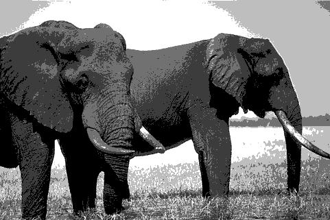

Pratical Work - Segmentation
============================

|Original Image|K-means++ - 3 clusters|Otsu's - 3 thresholds|K-means++ - 5 clusters|Otsu's - 5 thresholds|
| :---: | :---: | :---: | :---: | :---: |
||Time taken to segment: 0.958 seconds  **MeanStructuralSimilitaryIndex**: 0.55 **MeanSquaredError**: 3305.74 **PeakSignalNoiseRatio**: 12.94|Time taken to segment: 0.012 seconds  **MeanStructuralSimilitaryIndex**: 0.52 **MeanSquaredError**: 2858.32 **PeakSignalNoiseRatio**: 13.57|Time taken to segment: 1.563 seconds  **MeanStructuralSimilitaryIndex**: 0.76 **MeanSquaredError**: 996.10 **PeakSignalNoiseRatio**: 18.15|Time taken to segment: 6.318 seconds  **MeanStructuralSimilitaryIndex**: 0.68 **MeanSquaredError**: 825.42 **PeakSignalNoiseRatio**: 18.96|
||Time taken to segment: 1.403 seconds  **MeanStructuralSimilitaryIndex**: 0.35 **MeanSquaredError**: 2535.11 **PeakSignalNoiseRatio**: 14.09|Time taken to segment: 0.017 seconds  **MeanStructuralSimilitaryIndex**: 0.29 **MeanSquaredError**: 2868.60 **PeakSignalNoiseRatio**: 13.55|Time taken to segment: 1.818 seconds  **MeanStructuralSimilitaryIndex**: 0.58 **MeanSquaredError**: 1176.01 **PeakSignalNoiseRatio**: 17.43|Time taken to segment: 7.290 seconds  **MeanStructuralSimilitaryIndex**: 0.51 **MeanSquaredError**: 1338.60 **PeakSignalNoiseRatio**: 16.86|
||Time taken to segment: 1.163 seconds  **MeanStructuralSimilitaryIndex**: 0.55 **MeanSquaredError**: 2331.10 **PeakSignalNoiseRatio**: 14.46|Time taken to segment: 0.019 seconds  **MeanStructuralSimilitaryIndex**: 0.44 **MeanSquaredError**: 3165.09 **PeakSignalNoiseRatio**: 13.13|Time taken to segment: 1.554 seconds  **MeanStructuralSimilitaryIndex**: 0.71 **MeanSquaredError**: 556.74 **PeakSignalNoiseRatio**: 20.67|Time taken to segment: 5.912 seconds  **MeanStructuralSimilitaryIndex**: 0.59 **MeanSquaredError**: 841.58 **PeakSignalNoiseRatio**: 18.88|
||Time taken to segment: 0.816 seconds  **MeanStructuralSimilitaryIndex**: 0.48 **MeanSquaredError**: 2276.60 **PeakSignalNoiseRatio**: 14.56|Time taken to segment: 0.017 seconds  **MeanStructuralSimilitaryIndex**: 0.44 **MeanSquaredError**: 1807.47 **PeakSignalNoiseRatio**: 15.56|Time taken to segment: 1.448 seconds  **MeanStructuralSimilitaryIndex**: 0.69 **MeanSquaredError**: 889.81 **PeakSignalNoiseRatio**: 18.64|Time taken to segment: 5.722 seconds  **MeanStructuralSimilitaryIndex**: 0.66 **MeanSquaredError**: 1043.00 **PeakSignalNoiseRatio**: 17.95|
||Time taken to segment: 0.976 seconds  **MeanStructuralSimilitaryIndex**: 0.44 **MeanSquaredError**: 1219.45 **PeakSignalNoiseRatio**: 17.27|Time taken to segment: 0.017 seconds  **MeanStructuralSimilitaryIndex**: 0.36 **MeanSquaredError**: 1281.32 **PeakSignalNoiseRatio**: 17.05|Time taken to segment: 1.359 seconds  **MeanStructuralSimilitaryIndex**: 0.60 **MeanSquaredError**: 581.73 **PeakSignalNoiseRatio**: 20.48|Time taken to segment: 6.417 seconds  **MeanStructuralSimilitaryIndex**: 0.46 **MeanSquaredError**: 974.46 **PeakSignalNoiseRatio**: 18.24|
||Time taken to segment: 0.927 seconds  **MeanStructuralSimilitaryIndex**: 0.71 **MeanSquaredError**: 1080.76 **PeakSignalNoiseRatio**: 17.79|Time taken to segment: 0.018 seconds  **MeanStructuralSimilitaryIndex**: 0.61 **MeanSquaredError**: 1396.36 **PeakSignalNoiseRatio**: 16.68|Time taken to segment: 1.822 seconds  **MeanStructuralSimilitaryIndex**: 0.80 **MeanSquaredError**: 415.77 **PeakSignalNoiseRatio**: 21.94|Time taken to segment: 6.009 seconds  **MeanStructuralSimilitaryIndex**: 0.69 **MeanSquaredError**: 1047.20 **PeakSignalNoiseRatio**: 17.93|
||Time taken to segment: 0.899 seconds  **MeanStructuralSimilitaryIndex**: 0.46 **MeanSquaredError**: 7293.08 **PeakSignalNoiseRatio**: 9.50|Time taken to segment: 0.015 seconds  **MeanStructuralSimilitaryIndex**: 0.47 **MeanSquaredError**: 6683.47 **PeakSignalNoiseRatio**: 9.88|Time taken to segment: 1.446 seconds  **MeanStructuralSimilitaryIndex**: 0.55 **MeanSquaredError**: 2786.67 **PeakSignalNoiseRatio**: 13.68|Time taken to segment: 5.872 seconds  **MeanStructuralSimilitaryIndex**: 0.53 **MeanSquaredError**: 2640.70 **PeakSignalNoiseRatio**: 13.91|
||Time taken to segment: 1.196 seconds  **MeanStructuralSimilitaryIndex**: 0.44 **MeanSquaredError**: 3144.14 **PeakSignalNoiseRatio**: 13.16|Time taken to segment: 0.014 seconds  **MeanStructuralSimilitaryIndex**: 0.37 **MeanSquaredError**: 3223.83 **PeakSignalNoiseRatio**: 13.05|Time taken to segment: 1.701 seconds  **MeanStructuralSimilitaryIndex**: 0.71 **MeanSquaredError**: 746.56 **PeakSignalNoiseRatio**: 19.40|Time taken to segment: 5.972 seconds  **MeanStructuralSimilitaryIndex**: 0.49 **MeanSquaredError**: 1939.96 **PeakSignalNoiseRatio**: 15.25|
||Time taken to segment: 0.901 seconds  **MeanStructuralSimilitaryIndex**: 0.44 **MeanSquaredError**: 3643.82 **PeakSignalNoiseRatio**: 12.52|Time taken to segment: 0.013 seconds  **MeanStructuralSimilitaryIndex**: 0.41 **MeanSquaredError**: 2547.01 **PeakSignalNoiseRatio**: 14.07|Time taken to segment: 1.509 seconds  **MeanStructuralSimilitaryIndex**: 0.59 **MeanSquaredError**: 2573.27 **PeakSignalNoiseRatio**: 14.03|Time taken to segment: 5.406 seconds  **MeanStructuralSimilitaryIndex**: 0.50 **MeanSquaredError**: 1737.49 **PeakSignalNoiseRatio**: 15.73|
||Time taken to segment: 1.039 seconds  **MeanStructuralSimilitaryIndex**: 0.33 **MeanSquaredError**: 2789.55 **PeakSignalNoiseRatio**: 13.68|Time taken to segment: 0.020 seconds  **MeanStructuralSimilitaryIndex**: 0.26 **MeanSquaredError**: 2992.76 **PeakSignalNoiseRatio**: 13.37|Time taken to segment: 1.648 seconds  **MeanStructuralSimilitaryIndex**: 0.51 **MeanSquaredError**: 1767.50 **PeakSignalNoiseRatio**: 15.66|Time taken to segment: 5.400 seconds  **MeanStructuralSimilitaryIndex**: 0.45 **MeanSquaredError**: 1522.85 **PeakSignalNoiseRatio**: 16.30|
||Time taken to segment: 0.957 seconds  **MeanStructuralSimilitaryIndex**: 0.45 **MeanSquaredError**: 4630.72 **PeakSignalNoiseRatio**: 11.47|Time taken to segment: 0.024 seconds  **MeanStructuralSimilitaryIndex**: 0.39 **MeanSquaredError**: 5079.67 **PeakSignalNoiseRatio**: 11.07|Time taken to segment: 1.630 seconds  **MeanStructuralSimilitaryIndex**: 0.62 **MeanSquaredError**: 1642.89 **PeakSignalNoiseRatio**: 15.97|Time taken to segment: 5.625 seconds  **MeanStructuralSimilitaryIndex**: 0.55 **MeanSquaredError**: 2603.39 **PeakSignalNoiseRatio**: 13.98|
||Time taken to segment: 1.376 seconds  **MeanStructuralSimilitaryIndex**: 0.44 **MeanSquaredError**: 4727.92 **PeakSignalNoiseRatio**: 11.38|Time taken to segment: 0.019 seconds  **MeanStructuralSimilitaryIndex**: 0.39 **MeanSquaredError**: 5186.05 **PeakSignalNoiseRatio**: 10.98|Time taken to segment: 1.569 seconds  **MeanStructuralSimilitaryIndex**: 0.57 **MeanSquaredError**: 2277.03 **PeakSignalNoiseRatio**: 14.56|Time taken to segment: 5.784 seconds  **MeanStructuralSimilitaryIndex**: 0.53 **MeanSquaredError**: 2469.31 **PeakSignalNoiseRatio**: 14.21|
||Time taken to segment: 1.397 seconds  **MeanStructuralSimilitaryIndex**: 0.48 **MeanSquaredError**: 2342.72 **PeakSignalNoiseRatio**: 14.43|Time taken to segment: 0.021 seconds  **MeanStructuralSimilitaryIndex**: 0.37 **MeanSquaredError**: 3312.33 **PeakSignalNoiseRatio**: 12.93|Time taken to segment: 1.932 seconds  **MeanStructuralSimilitaryIndex**: 0.73 **MeanSquaredError**: 642.11 **PeakSignalNoiseRatio**: 20.05|Time taken to segment: 5.997 seconds  **MeanStructuralSimilitaryIndex**: 0.59 **MeanSquaredError**: 1583.56 **PeakSignalNoiseRatio**: 16.13|
||Time taken to segment: 0.852 seconds  **MeanStructuralSimilitaryIndex**: 0.67 **MeanSquaredError**: 12724.63 **PeakSignalNoiseRatio**: 7.08|Time taken to segment: 0.014 seconds  **MeanStructuralSimilitaryIndex**: 0.70 **MeanSquaredError**: 10661.68 **PeakSignalNoiseRatio**: 7.85|Time taken to segment: 1.221 seconds  **MeanStructuralSimilitaryIndex**: 0.65 **MeanSquaredError**: 9671.51 **PeakSignalNoiseRatio**: 8.28|Time taken to segment: 5.429 seconds  **MeanStructuralSimilitaryIndex**: 0.67 **MeanSquaredError**: 6018.87 **PeakSignalNoiseRatio**: 10.34|
||Time taken to segment: 0.870 seconds  **MeanStructuralSimilitaryIndex**: 0.52 **MeanSquaredError**: 1896.01 **PeakSignalNoiseRatio**: 15.35|Time taken to segment: 0.018 seconds  **MeanStructuralSimilitaryIndex**: 0.42 **MeanSquaredError**: 2081.28 **PeakSignalNoiseRatio**: 14.95|Time taken to segment: 1.665 seconds  **MeanStructuralSimilitaryIndex**: 0.72 **MeanSquaredError**: 750.00 **PeakSignalNoiseRatio**: 19.38|Time taken to segment: 5.377 seconds  **MeanStructuralSimilitaryIndex**: 0.59 **MeanSquaredError**: 916.66 **PeakSignalNoiseRatio**: 18.51|
||Time taken to segment: 1.019 seconds  **MeanStructuralSimilitaryIndex**: 0.80 **MeanSquaredError**: 2973.78 **PeakSignalNoiseRatio**: 13.40|Time taken to segment: 0.013 seconds  **MeanStructuralSimilitaryIndex**: 0.79 **MeanSquaredError**: 3072.93 **PeakSignalNoiseRatio**: 13.26|Time taken to segment: 1.599 seconds  **MeanStructuralSimilitaryIndex**: 0.83 **MeanSquaredError**: 2431.60 **PeakSignalNoiseRatio**: 14.27|Time taken to segment: 5.485 seconds  **MeanStructuralSimilitaryIndex**: 0.81 **MeanSquaredError**: 2340.02 **PeakSignalNoiseRatio**: 14.44|
||Time taken to segment: 0.803 seconds  **MeanStructuralSimilitaryIndex**: 0.41 **MeanSquaredError**: 1765.92 **PeakSignalNoiseRatio**: 15.66|Time taken to segment: 0.017 seconds  **MeanStructuralSimilitaryIndex**: 0.31 **MeanSquaredError**: 1920.15 **PeakSignalNoiseRatio**: 15.30|Time taken to segment: 1.568 seconds  **MeanStructuralSimilitaryIndex**: 0.51 **MeanSquaredError**: 1344.56 **PeakSignalNoiseRatio**: 16.84|Time taken to segment: 5.372 seconds  **MeanStructuralSimilitaryIndex**: 0.41 **MeanSquaredError**: 1477.38 **PeakSignalNoiseRatio**: 16.44|
||Time taken to segment: 1.124 seconds  **MeanStructuralSimilitaryIndex**: 0.33 **MeanSquaredError**: 5468.04 **PeakSignalNoiseRatio**: 10.75|Time taken to segment: 0.014 seconds  **MeanStructuralSimilitaryIndex**: 0.30 **MeanSquaredError**: 5896.92 **PeakSignalNoiseRatio**: 10.42|Time taken to segment: 1.564 seconds  **MeanStructuralSimilitaryIndex**: 0.51 **MeanSquaredError**: 2540.58 **PeakSignalNoiseRatio**: 14.08|Time taken to segment: 5.358 seconds  **MeanStructuralSimilitaryIndex**: 0.45 **MeanSquaredError**: 3502.91 **PeakSignalNoiseRatio**: 12.69|
||Time taken to segment: 1.096 seconds  **MeanStructuralSimilitaryIndex**: 0.50 **MeanSquaredError**: 3329.08 **PeakSignalNoiseRatio**: 12.91|Time taken to segment: 0.013 seconds  **MeanStructuralSimilitaryIndex**: 0.30 **MeanSquaredError**: 4103.14 **PeakSignalNoiseRatio**: 12.00|Time taken to segment: 1.753 seconds  **MeanStructuralSimilitaryIndex**: 0.70 **MeanSquaredError**: 1379.52 **PeakSignalNoiseRatio**: 16.73|Time taken to segment: 5.375 seconds  **MeanStructuralSimilitaryIndex**: 0.47 **MeanSquaredError**: 2412.27 **PeakSignalNoiseRatio**: 14.31|
||Time taken to segment: 0.947 seconds  **MeanStructuralSimilitaryIndex**: 0.41 **MeanSquaredError**: 3148.93 **PeakSignalNoiseRatio**: 13.15|Time taken to segment: 0.013 seconds  **MeanStructuralSimilitaryIndex**: 0.36 **MeanSquaredError**: 3275.68 **PeakSignalNoiseRatio**: 12.98|Time taken to segment: 2.315 seconds  **MeanStructuralSimilitaryIndex**: 0.53 **MeanSquaredError**: 1801.53 **PeakSignalNoiseRatio**: 15.57|Time taken to segment: 5.405 seconds  **MeanStructuralSimilitaryIndex**: 0.47 **MeanSquaredError**: 1883.25 **PeakSignalNoiseRatio**: 15.38|
